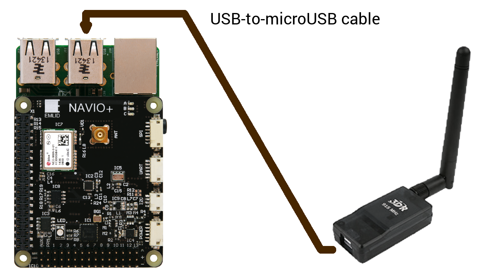

####GNSS antenna

####RC input
Navio+ is a PPM only autopilot. That means that you will have to use receiver with PPM output, PPM decoder or SBUS to PPM converter.

####RC output

Power module does not provide power to servos so a BEC should be present. BEC would serve as back-up power supply to Navio+.

Only one ESC central wire should be connected to Navio+ otherwise BECs built in ESCs will heat each other.

#### Telemetry modem

