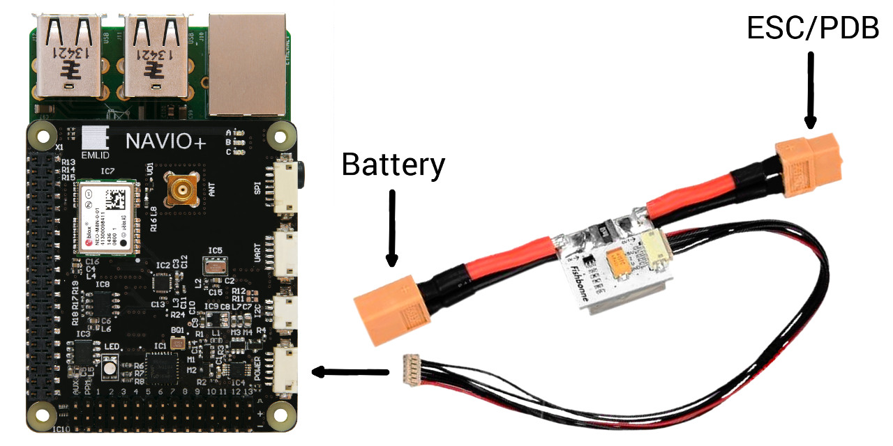

#### APM


You can run APM (ArduPilot) on Raspberry Pi with Navio or Navio+. The autopilot's code works directly on Raspberry Pi using the APM's Linux HAL. Even though it is possible to run APM on standard Raspbian distribution it won't work properly as it requires lower latency. Please use Raspbian with real time kernel for running APM, you can get it in download section.

Important! Keep in mind that the code for Navio is in the experimental state. Use it with caution!

####State of the APM port to Raspberry Pi with Navio
These things were already supported in APM's library and worked with minimal configuration:

* MPU9250 inertial sensor
*  barometer
* Serial port

What has been added:

* Raspberry Pi build configuration
* Navio board configuration
* GPIO driver for Raspberry Pi
* RCOutput based on PCA9685 with 24.576 external oscillator
* RCInput - uses pigpio daemon to sample GPIOs with 1MHz rate, should be rewritten to work without pigpio
* RGB LED
* MPU9250 built-in compass driver
* U-blox GPS SPI driver
* ADC based on ADS1115

####Installing APM

Log in to your Raspberry Pi using SSH or other method, download the deb package with APM binaries using wget and install it. Deb package contains binaries that are compatible with Navio, Navio Raw or Navio+:

```bash
wget http://emlid.com/files/APM/apm.deb
sudo dpkg -i apm.deb
```

If you'd like to build the binary yourself please proceed to the [Building from sources](building-from-sources.md).
####Running APM

Supported vehicle types are:
* APMrover2
* ArduPlane
* ArduCopter-quad
* ArduCopter-tri
* ArduCopter-hexa
* ArduCopter-y6
* ArduCopter-octa
* ArduCopter-octa-quad
* ArduCopter-heli
* ArduCopter-single

To run APM binary type the following in your RPi's console (change ArduCopter-quad to your vehicle type):

```bash
sudo ArduCopter-quad -A udp:192.168.1.2:14550
```

Where 192.168.1.2 is the IP address of the device with the Ground Control Station - your laptop, smartphone etc.

Arguments specify serial ports (TCP or UDP can be used instead of serial ports) :

* -A is for primary telemetry
* -B is for external GPS
* -C is for secondary telemetry (it can be used without primary telemetry)
* -E is for secondary external GPS

When using UART for telemetry please note that default baud rates are:
115200 for primary (-A)
57600 for secondary (-C)
3DR Radios are configured for 57600 by default, so te simplest way to connect over them is to run with -C option.
If you would like to transfer telemetry over the UART port on Navio you can specify it like this:

```bash
sudo ArduCopter-quad -C /dev/ttyAMA0
```

UDP and serial telemetry can be used simultaneously like this:

```bash
sudo ArduCopter-quad -A udp:192.168.1.2:14550 -C /dev/ttyAMA0
```

####Autostarting APM on boot
To automatically start APM on boot add the following (change -A and -C options to suit your setup) to /etc/rc.local file on your Raspberry Pi:

```bash
sudo ArduCopter-quad -A udp:192.168.1.2:14550 -C /dev/ttyAMA0 > /home/pi/startup_log &
```

####Connecting to the GCS
**APM Planner**

APM Planner is a ground station software for APM. It can be downloaded from the
[ardupilot.com](http://ardupilot.com/downloads/?category=35)

APM Planner listens on UDP port 14550, so it should catch telemetry from the drone automatically.

**MAVProxy**

MAVProxy is a console-oriented ground station software written in Python that can be used standalone or together with APM Planner. It’s well suited for advanced users and developers. MAVProxy can be installed with pip:

```bash
pip install mavlink mavproxy console wp
```


To run it specify the --master port, which can be serial, TCP or UDP. It also can perform data passthrough using --out option.

```bash
<>mavproxy.py --master 192.168.1.2:14550 --console
```

Where 192.168.1.2 is the IP address of the GCS, not RPi.

####Skip board voltage check

As Raspberry has no data about Navio board voltage, prearm check should be disabled as shown [here](http://copter.ardupilot.com/wiki/flying-arducopter/prearm_safety_check/). Pick "Skip Voltage".

####Voltage and current sensing

If you have original power module connected to Navio+, you can get battery voltage and curent readings from it. Simply press on the "Pixhawk Power Module 90A" in APM Planner to setup voltage and current measurement for APM:


After that you can check in full parameter list that:

```bash
BATT_CURR_PIN 3
BATT_VOLT_PIN 2
```

CTRL+C to kill ArduCopter and run again using:

```bash
sudo ArduCopter-quad -A udp:192.168.1.2:14550
```

You should see voltage and current values. After that it works everytime.

####Further configuration

As other APM configuration procedures are very similar for most APM-running autopilot hardware, please use the APM documentation. 

*Important*: There is no need to perform "4. Load Copter Firmware" step as APM is installed using deb package or binary on RPi with Navio. Also, frame type is selected by running the corresdonding binary as described above.

[Hardware configuration](http://copter.ardupilot.com/wiki/initial-setup/configuring-hardware) 

[ESC Calibration](http://copter.ardupilot.com/wiki/initial-setup/configuring-hardware) 

[Motor Setup](http://copter.ardupilot.com/wiki/initial-setup/configuring-hardware) 

[Enable RC Failsafe](http://copter.ardupilot.com/wiki/configuration/throttle-failsafe/)!
